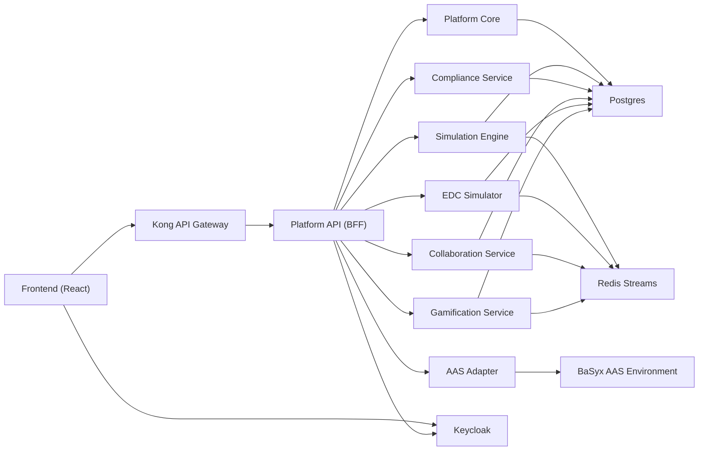

# DPP Simulation Playground

[](https://github.com/hadijannat/dpp-simulation-playground/actions/workflows/ci.yml)

A production-oriented simulation platform for **Digital Product Passport (DPP)** workflows.

It models end-to-end journeys across:
- Simulation runtime
- Compliance validation and fix loops
- EDC-style data exchange
- Collaboration and annotations
- Gamification and progression
- Digital twin history and diffs

The stack is a React frontend + FastAPI microservices behind Kong, with Keycloak auth, Postgres, Redis Streams, MongoDB, MinIO, and BaSyx.

## Why this project exists

DPP programs are cross-functional. Product, regulatory, and integration teams need a safe environment to run realistic scenarios before production rollout.

This playground provides that environment with:
- Role-aware journeys and step execution
- Policy and compliance feedback loops
- Event-driven scoring and achievements
- Traceable digital twin snapshots over time

## Architecture at a glance



## Prerequisites

- Docker + Docker Compose
- GNU Make
- Python 3.11+ (for local scripts)
- Node.js 20+ (for frontend local development)

## Quick Start (Docker)

1. Copy env defaults:

```bash
cp infrastructure/docker/.env.example infrastructure/docker/.env
```

2. Start the stack:

```bash
make up
```

3. Apply migrations:

```bash
make migrate
```

4. Backfill journey runs (v2 runtime model):

```bash
make backfill
```

5. Seed demo data:

```bash
make seed
```

6. Open the app:

- Frontend: `http://localhost:3000`
- Gateway: `http://localhost:8000`
- Platform API health: `http://localhost:8000/api/v2/health`

### Default demo credentials

- Username: `demo@example.com`
- Password: `demo1234`

## Service map

| Service | Direct URL | Gateway path |
|---|---|---|
| Frontend | `http://localhost:3000` | n/a |
| Kong API Gateway | `http://localhost:8000` | n/a |
| Simulation Engine | `http://localhost:8101` | `http://localhost:8000` |
| Compliance Service | `http://localhost:8102` | `http://localhost:8000` |
| Gamification Service | `http://localhost:8103` | `http://localhost:8000` |
| EDC Simulator | `http://localhost:8104` | `http://localhost:8000` |
| Collaboration Service | `http://localhost:8105` | `http://localhost:8000` |
| Platform API (v2 BFF) | `http://localhost:8106` | `http://localhost:8000/api/v2` |
| Platform Core | `http://localhost:8107` | internal |
| AAS Adapter | `http://localhost:8108` | internal |
| Keycloak | `http://localhost:8080` | n/a |
| BaSyx AAS Environment | `http://localhost:8281` | n/a |
| MinIO API / Console | `http://localhost:9100` / `http://localhost:9101` | n/a |

## Common developer workflows

```bash
make help            # list available commands
make up              # start stack
make up-dev          # start with dev overlay
make logs            # tail logs
make down            # stop services
make clean           # stop + remove volumes
make health          # health check script
make migrate         # run shared migrations
make seed            # seed demo data
make openapi         # export service OpenAPI + regenerate frontend client
make contract-check  # validate frontend routes against generated OpenAPI
make rbac-sync       # regenerate RBAC matrix
make rbac-check      # verify matrix is in sync
make story-lint      # validate story definitions
```

## Local (without Docker)

Frontend:

```bash
cd frontend
npm install
npm run dev
```

Backend service (example):

```bash
cd services/platform-api
pip install -r requirements.txt -r requirements-dev.txt
uvicorn app.main:app --reload --port 8106
```

## Security and auth defaults

Key auth settings are environment-driven and shared across services:

- `AUTH_MODE` (`keycloak`, `bypass`, `auto`; default `auto`)
- `DEV_BYPASS_AUTH` (local/dev only)
- `KEYCLOAK_URL`, `KEYCLOAK_REALM`
- `KEYCLOAK_ISSUERS`
- `KEYCLOAK_AUDIENCES` / `KEYCLOAK_AUDIENCE`
- `REQUIRE_TOKEN_AUDIENCE` (default `true`)
- `JWT_CLOCK_SKEW_SECONDS` (default `30`)

Platform API hardening flag:

- `ALLOW_DEV_HEADERS` (default `false`; keep disabled outside local/dev)

Production-safe baseline:

- Set `AUTH_MODE=keycloak` in non-dev deployments.
- Keep `ALLOW_DEV_HEADERS=false` outside local development.
- Use `AUTH_MODE=bypass` only in explicit local/test environments.

## Eventing and reliability knobs

The platform uses Redis Streams for async eventing (`simulation.events` + retry + DLQ). Useful limits:

- `EVENT_STREAM_MAXLEN` (default `50000`)
- `STREAM_MAXLEN` (default `50000`)
- `RETRY_STREAM_MAXLEN` (default `20000`)
- `DLQ_STREAM_MAXLEN` (default `20000`)
- `STREAM_TRIM_INTERVAL_SECONDS` (default `300`)

Outbox worker controls:

- `OUTBOX_WORKER_ENABLED` (default `true`)
- `OUTBOX_PUBLISH_BATCH_SIZE` (default `50`)
- `OUTBOX_PUBLISH_INTERVAL_MS` (default `1000`)
- `OUTBOX_LOCK_TIMEOUT_SECONDS` (default `60`)

Tracing/telemetry controls:

- `OTEL_EXPORTER_OTLP_ENDPOINT` (optional OTLP HTTP endpoint for trace export)
- `OTEL_RESOURCE_ATTRIBUTES` (optional comma-separated key=value resource attributes)

## Project layout

```text
frontend/                     React app + typed API client
services/
  platform-api/               Gateway/BFF for v2 APIs
  platform-core/              Journey runtime + digital twin data APIs
  simulation-engine/          Story/session/step execution
  compliance-service/         Rules, reports, apply-fix support
  edc-simulator/              Catalog, negotiations, transfers
  collaboration-service/      Gaps, annotations, votes, comments
  gamification-service/       Stream consumer, points, achievements
  aas-adapter/                BaSyx-facing AAS operations
  shared/                     Common auth/events/models/migrations
infrastructure/docker/        Compose files and service infra
docs/                         Architecture, APIs, compliance, runbooks
scripts/                      Repo automation and maintenance scripts
```

## API contracts and docs

- Service OpenAPI specs: `docs/api/openapi/`
- Export specs and regenerate frontend types:

```bash
make openapi
```

- Run route-contract validation:

```bash
make contract-check
```

## Recommended docs next

- Getting started: `docs/guides/GETTING_STARTED.md`
- Architecture: `docs/architecture/ARCHITECTURE.md`
- Security architecture: `docs/architecture/SECURITY_ARCHITECTURE.md`
- RBAC matrix: `docs/architecture/RBAC_MATRIX.md`
- Story authoring: `docs/guides/ADDING_STORIES.md`
- Compliance rules: `docs/guides/ADDING_COMPLIANCE_RULES.md`
- Event debugging: `docs/guides/EVENT_DEBUG_RUNBOOK.md`
- Step failure debugging: `docs/guides/STEP_FAILURE_DEBUG_RUNBOOK.md`

## Contributing

- Contribution guide: `CONTRIBUTING.md`
- Security policy: `SECURITY.md`
- Changelog: `CHANGELOG.md`
